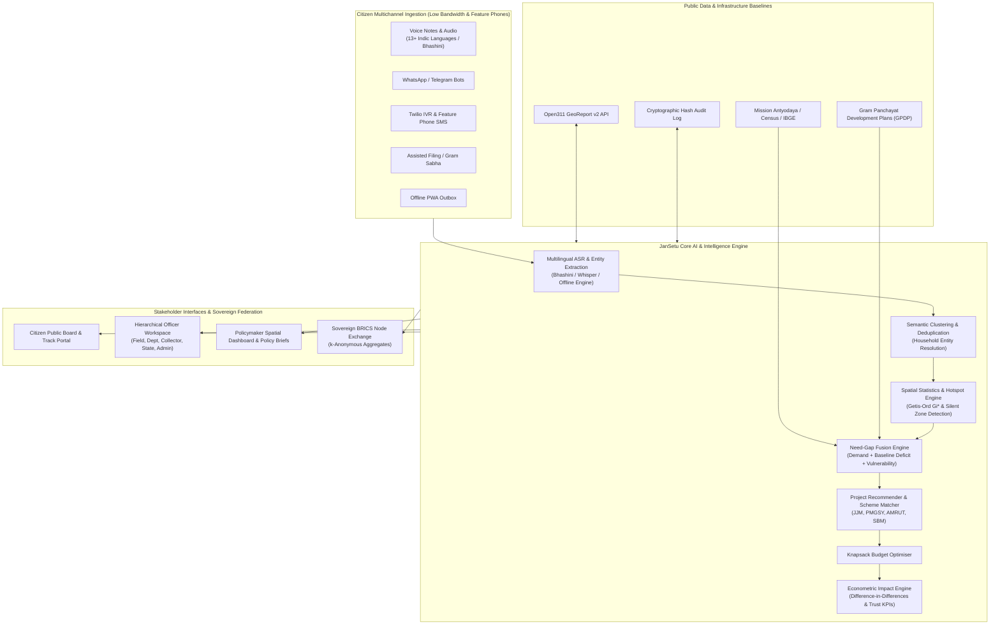

# JanSetu: Citizen Demand Intelligence for BRICS
## Comprehensive Project Report & Full-Screen Interface Atlas

---

### Executive Summary

> **"Grievance systems answer complaints. JanSetu answers where the next rupee, real or rand should go, and whether it worked."**

**JanSetu** (*"People's Bridge"*) is an open-source, multilingual, federated AI platform built as a **Digital Public Good (DPG)** under **BRICS Track 1: AI for Digital Public Infrastructure & Governance (Innovation Theme)**.

Traditional grievance redressal mechanisms treat each citizen grievance as an isolated ticket to be closed as quickly as possible. This approach suffers from critical blind spots:
1. **Loudest Voices Win**: Well-connected urban centers flood grievance portals, while remote, marginalized villages with no connectivity remain invisible ("Silent Zones").
2. **Fragmented Planning**: Grievance tickets are kept in silos away from government capital expenditure plans (GPDP, PMGSY, Jal Jeevan Mission, AMRUT).
3. **Superficial Disposal**: Success is measured by "disposal speed" rather than whether the underlying community need was verified as solved by the citizens themselves.
4. **National Silos**: Member nations lack a privacy-preserving framework to benchmark infrastructure delivery and share demand intelligence across borders.

**JanSetu fundamentally reinvents this paradigm:**
- **Aggregates Multi-Channel Voices**: Ingests citizen requests via Voice, Text, WhatsApp, Telegram, Twilio IVR, SMS, and Gram Sabha assisted filing in 13+ languages (powered by Bhashini and local offline speech engines).
- **Forms Household Demand Clusters**: Deduplicates and groups thousands of individual requests into coherent community demand clusters counted by unique verified households.
- **Fuses Spatial & Vulnerability Data**: Integrates demographic indices, baseline infrastructure deficits (Mission Antyodaya, IBGE, Stats SA), and existing sanctioned project plans.
- **Discovers Hotspots & Silent Zones**: Uses spatial statistics (Getis-Ord $Gi^*$) to locate genuine demand hotspots and statistically anomalous silent zones (high deficit + low complaints).
- **Synthesizes Costed, Explainable Projects**: Generates ranked, costed infrastructure projects with funding scheme convergence, mathematical "Why this project?" explainability cards, and a Knapsack Budget Optimiser.
- **Measures DPI Impact**: Conducts econometric Difference-in-Differences (DiD) evaluations to quantify complaint drop rates, baseline indicator improvements, and citizen trust over time.
- **Enables Sovereign BRICS Federation**: Operates as a federated network of sovereign national nodes where only $k$-anonymous aggregate demand indices cross borders.

---

### High-Level System Architecture

---

### Platform Metric Snapshot

| Dimension | Platform Live Metric | Description |
|---|---|---|
| **Total Ingested Grievances** | **27,009** | Multichannel citizen submissions across urban and rural blocks |
| **Unique Verified Households** | **18,691** | Entity-resolved household units behind petitions |
| **Demand Clusters Identified** | **1,214** | Geographically and semantically grouped community needs |
| **AI Suggested Projects** | **81** | Fully costed, scheme-converged infrastructure proposals |
| **Identified Silent Zones** | **21 Areas** | Extreme infrastructure deficit ($>50\%$) with suppressed complaint volumes |
| **Linguistic Reach** | **8 Active Languages** | Telugu, Hindi, Marathi, Odia, English, Portuguese, Zulu, Xhosa |
| **Audio / Speech Share** | **16%** | Non-textual submissions processed via automated speech recognition |
| **DPI Compliance** | **9 / 9 Indicators** | Full adherence to Digital Public Goods Alliance (DPGA) standard |

---

# Complete Interface Atlas with Full-Screen Screenshots

Each section below provides a full-width desktop capture of the platform's user interfaces, accompanied by functional breakdowns, data flows, and administrative significance.

---

### Page 01: Public Landing Portal (`/`)

The public entry point introduces citizens, field workers, and administrators to the JanSetu mission. It provides instant language switching (English, Hindi, Telugu, Marathi, Portuguese, Zulu), quick statistics on community needs identified, and direct pathways to report issues, track filed requests, or review completed public projects without requiring citizen registration.

#### Functional Highlights:
- **No Citizen Login Required**: Designed around privacy-first principles where citizens can interact without mandatory identity hurdles.
- **Language Switcher & Accessibility Controls**: Quick toggles for font scaling, high-contrast mode, and screen-reader optimizations complying with WCAG 2.1 AA.
- **Live Platform Counters**: Demonstrates real-time demand aggregation from 27,000+ citizens and 18,600+ households.

---

### Page 02: Citizen Multimodal Report Intake (`/report`)

The core citizen intake interface allows citizens to file grievances and development demands through voice audio recordings, natural language text, geo-tagged photo uploads, and interactive map pin-dropping.

#### Functional Highlights:
- **Speech-to-Text Voice Recording**: Citizens can record in their native mother tongue (e.g., Gondi, Telugu, Marathi). Bhashini and Whisper models transcribe and translate the input on the fly.
- **Offline Outbox & Auto-Sync**: In low-connectivity or zero-signal regions, requests are stored locally in IndexedDB and automatically transmitted once network connectivity resumes.
- **AI Category & Urgency Classification**: Automatically extracts sector categories (Water, Road, Sanitation, Power, Health, Education) and flags life-safety emergencies.
- **Geographic Pinning**: Citizens can tap their exact location on the map or allow HTML5 GPS capture.

---

### Page 03: Citizen Request Lookup Portal (`/track`)

Citizens can track the live lifecycle status of any submitted grievance or community demand using their unique Tracking ID or mobile phone number.

#### Functional Highlights:
- **Zero-Friction Search**: Fast lookup with masked phone validation (last 4 digits) to protect citizen privacy.
- **Multi-Request Dashboard**: Citizens filing multiple petitions can view their complete interaction history on a single screen.
- **Public Results Quick-Link**: Seamless link to inspect neighborhood-wide public sanction and resolution boards.

---

### Page 04: Citizen Request Lifecycle & Resolution Verification (`/track/:id`)

When a citizen inspects a specific request, JanSetu presents a transparent timeline tracking the petition from initial intake through engineering assignment, on-site inspection, work execution, and citizen sign-off.

#### Functional Highlights:
- **Immutable Timestamped Timeline**: Every transition (Received $\rightarrow$ Triaged $\rightarrow$ Assigned $\rightarrow$ Field Inspected $\rightarrow$ Resolved $\rightarrow$ Confirmed) is logged with official attribution.
- **Citizen Confirmation & Dispute Action**: Government officers cannot unilaterally close tickets. Citizens are invited to tap *"Confirm Fix"* or *"Dispute Resolution"* if the ground reality does not match the report.
- **Public Ground Evidence**: Transparent display of original voice transcripts, translated English text, and geo-tagged proof photographs.

---

### Page 05: Omnichannel Ingestion Simulator (`/channels`)

To accommodate India's vast feature-phone user base and digital divide, JanSetu supports messaging bots, interactive voice response (IVR), and assisted filing. The Omnichannel Simulator allows government evaluators to test all five intake channels in real time.

#### Supported Channels:
1. **WhatsApp Bot Webhook**: Interactive chat allowing text, audio voice notes, and live camera photo submissions.
2. **Telegram Bot**: Long-polling bot supporting multilingual group submissions.
3. **Twilio IVR Voice Call (Toll-Free 1800)**: Interactive voice response allowing citizens with basic 2G handsets to record grievances over standard phone lines.
4. **Feature Phone SMS**: Structured keyword and free-form SMS reporting.
5. **Assisted Gram Sabha Filing**: Dedicated portal for Village Panchayat secretaries and ASHA workers to record community requests on behalf of elderly or illiterate citizens.

---

### Page 06: Public Results & Citizen Accountability Board (`/results`)

True civic accountability requires closing the feedback loop publicly. The Public Results Board displays all verified public works completed under JanSetu, before-and-after photographic evidence, and aggregated citizen satisfaction ratings.

#### Functional Highlights:
- **Public Proof Gallery**: Side-by-side verification photos of repaired water pipelines, newly laid all-weather roads, and energized transformers.
- **Open Data CSV Export**: Complete, unredacted (yet anonymized) export of all demand data for independent researchers, journalists, and civic watchdogs.
- **Community Resolution Scorecard**: Shows average turnaround time (SLA) and citizen verification rates broken down by administrative block.

---

### Page 07: Unified Multi-Role Authentication Portal (`/login`)

JanSetu features a hierarchical Role-Based Access Control (RBAC) engine tailored to the administrative structure of Indian and BRICS governance. The login portal includes a one-click demo account switcher across all 6 administrative tiers.

#### Administrative Roles:
1. **Super Admin (National Master)**: Unrestricted access across all states, departments, users, and audit logs.
2. **National Admin / Planner**: Access to macro policy briefs, budget optimizer, and BRICS federated analytics.
3. **State Grievance Officer**: Statewide oversight, inter-district priority ranking, and state scheme convergence.
4. **District Collector / Magistrate**: Approves local capital projects, allocates convergence budgets, and oversees district departments.
5. **Department Officer (Water / PWD / Health)**: Reviews field inspection proofs and assigns work orders to junior engineers.
6. **Field Redressal Officer / Engineer**: On-ground engineer responsible for resolving work orders and uploading mandatory geo-tagged proofs.

---

### Page 08: Policymaker Spatial Intelligence Dashboard (`/dashboard`)

The flagship command center for senior planners and District Collectors. It features an interactive GIS Leaflet map highlighting demand hotspots and silent zones, dynamic Need-Gap Index scoring weight sliders, and prioritized project recommendations.

#### Functional Highlights:
- **Getis-Ord $Gi^*$ Hotspot Rendering**: Statistically calculates spatial clustering of demand with 99%, 95%, and 90% confidence intervals.
- **Interactive Policy Scoring Sliders**: Real-time recalculation of the Need-Gap Index by tuning weights for *Citizen Demand*, *Infrastructure Deficit*, *Vulnerability*, *Severity to Life*, and *Existing Project Discount*.
- **Silent Zone Toggle**: Isolates remote tribal and rural habitations where severe infrastructure deficits exist but complaint volumes are artificially suppressed due to lack of digital connectivity.
- **Top 10 Ranked Projects Feed**: Instantly displays prioritized projects with estimated cost, beneficiary reach, and funding scheme convergence.

---

### Page 09: Demand Clustering Intelligence (`/clusters`)

Individual grievance tickets are rarely actionable on their own. JanSetu groups thousands of citizen requests into coherent community demand clusters based on geographic proximity and semantic similarity.

#### Functional Highlights:
- **Household-Level Aggregation**: Accurately counts unique affected households rather than raw complaint counts, preventing spam or repeated calls from skewing priorities.
- **Sectoral Tagging & Urgency Badges**: Visual categorization into Water, Roads, Sanitation, Power, and Public Health with urgency markers.
- **Cluster Status Pipeline**: Tracks community needs from *Gathering Voices* to *Under Review*, *Project Proposed*, and *Sanctioned*.

---

### Page 10: Demand Cluster Deep-Dive (`/clusters/1`)

Clicking into any demand cluster reveals the complete evidentiary trail. Planners can review the exact citizen quotes, original voice notes, English translations, sentiment scores, and historical trends that justify public expenditure.

#### Functional Highlights:
- **Multilingual Citizen Ground Evidence**: Verbatim quotes in Telugu, Hindi, or Marathi with side-by-side English translations and tracking ID cross-references.
- **Audio Transcript Audit**: Preserves exact words spoken by rural citizens during phone calls or WhatsApp voice notes.
- **"Me Too" Support Counter**: Demonstrates grassroots community consensus with one-tap citizen endorsements from nearby residents.

---

### Page 11: Need-Gap Index & Knapsack Budget Optimiser (`/priorities`)

This interface operationalizes the platform's core algorithmic innovation: the **Need-Gap Index (NGI)**. It allows administrators to simulate capital budget allocations and identify misaligned government spending.

#### Functional Highlights:
- **Algorithmic Knapsack Optimization**: Given a fixed district or municipal budget (e.g., ₹10 Crore / $1.2M), the integer linear programming solver selects the combination of projects that maximizes total citizen need alleviation.
- **Scheme Convergence**: Matches proposed projects to sanctioned central/state schemes (e.g., *Jal Jeevan Mission*, *PMGSY*, *AMRUT*, *Swachh Bharat*), ensuring zero duplicate funding.
- **Misaligned Spending Audit**: Flags pre-budgeted government items planned in areas where citizens report zero need, redirecting funds to acute deficit zones.

---

### Page 12: Ranked Projects Pipeline & Sanctions (`/projects`)

A project lifecycle management dashboard where proposed public works move through administrative approvals, technical sanctions, financial sanctions, tendering, and execution.

#### Functional Highlights:
- **One-Click Official Sanctions**: District Collectors and State Officers can sanction or defer projects directly with mandatory reason notes.
- **Automated Citizen Notifications**: Upon project sanction, all citizens who contributed petitions to that demand cluster receive automated SMS/WhatsApp notifications in their own languages.
- **Budget Tracking**: Real-time tally of sanctioned versus proposed capital expenditure in local currency (INR ₹, BRL R$, ZAR R) and USD.

---

### Page 13: Conversational Policy AI ("Ask JanSetu") (`/ask`)

A natural language conversational interface enabling policymakers, commissioners, and researchers to query the vast citizen demand repository in plain English or Indic languages.

#### Functional Highlights:
- **Grounded Semantic RAG**: Generates answers strictly grounded in actual citizen petitions, baseline infrastructure metrics, and approved budgets—preventing hallucination.
- **Sample One-Click Inquiries**: Quick queries for *"Which areas have acute drinking water deficits?"*, *"Identify silent zones needing urgent field outreach"*, and *"What is our spending alignment score?"*.
- **Citations & Tracking ID Links**: Every fact stated by the AI links directly to underlying demand clusters and individual tracking IDs.

---

### Page 14: Automated Executive Policy Brief Generator (`/brief`)

Cabinet Ministers and Chief Secretaries need succinct, actionable summaries rather than raw data feeds. The Policy Brief Generator synthesizes demand trends, silent zones, and budgetary recommendations into formatted, printable executive briefing documents.

#### Functional Highlights:
- **Printable Executive Memorandum**: Generates high-density, cleanly structured policy memos formatted for official government printing.
- **High-Priority Interventions**: Highlights the top 3-5 immediate infrastructure projects required to alleviate severe health and safety risks.
- **Silent Zone Alerts**: Specifically identifies neglected habitations requiring mobile enrollment vans and Gram Sabha consultations.

---

### Page 15: Econometric Impact Evaluation & Trust KPIs (`/impact`)

JanSetu is designed not just to plan projects, but to verify whether Digital Public Infrastructure actually improved citizen well-being. This interface provides econometric evaluation using Difference-in-Differences (DiD) methodology.

#### Evaluated Metrics:
- **Difference-in-Differences ($\beta$ Estimate)**: Measures the change in grievance volume in intervention blocks versus matched control blocks before and after project execution.
- **Baseline Deficit Improvement**: Tracks tangible changes in public infrastructure indices (e.g., tap water availability percentage, all-weather road connectivity).
- **Citizen Trust & SLA Scorecard**: Aggregates citizen verification confirmation rates and measures resolution speed against citizen charter deadlines.

---

### Page 16: BRICS Federated Intelligence Exchange (`/brics`)

Demonstrating the platform's vision for BRICS-wide cooperation, the Federated Exchange allows sovereign nodes (e.g., India, Brazil, South Africa) to benchmark public service delivery and exchange best practices without compromising data sovereignty.

#### Functional Highlights:
- **Sovereign Node Architecture**: Each nation runs its own sovereign database, hosting all citizen personally identifiable information (PII) strictly within national borders.
- **$k$-Anonymity Privacy Guarantee**: Only privacy-preserved, $k$-anonymous aggregates (e.g., sector need indices, convergence efficiency ratios) cross borders.
- **Cross-National Benchmarking**: Compares demand resolution speed, silent zone coverage, and capital efficiency across BRICS member states.

---

### Page 17: Digital Public Good Compliance & Explainable AI (`/trust`)

Transparency and trust are paramount for government AI adoption. This page provides full auditability of JanSetu's compliance with the 9 Digital Public Goods Alliance (DPGA) indicators, open mathematical formulas, and Open311 API endpoints.

#### Key Compliance Criteria:
- **DPG 9/9 Indicators**: Apache 2.0 open-source license, platform independence, open standards, privacy compliance (DPDP Act 2023 & GDPR), and adherence to the "Do No Harm" doctrine.
- **Open Mathematical Formulas**: Complete, unblackboxed transparency of the Need-Gap Index, spatial statistics, and ranking equations.
- **Open311 GeoReport v2 API**: Interoperability endpoints enabling third-party municipal software to ingest or export grievance data.

---

### Page 18: Tamper-Evident Cryptographic Audit Trail (`/audit`)

To ensure absolute administrative accountability and eliminate corruption in project approvals, every official action is logged to an immutable, cryptographically verifiable audit trail.

#### Functional Highlights:
- **SHA-256 Hash Verification**: Every log entry contains the cryptographic hash of the preceding entry, forming an unbroken tamper-evident ledger.
- **Granular Activity Logging**: Logs grievance submissions, status modifications, officer work reassignments, and financial sanction approvals.
- **Auditor Search & Filtering**: Allows external anti-corruption vigilance agencies to query actions by timestamp, officer ID, or project ID.

---

### Page 19: Field Officer Operational Workspace (`/officer` · Field Engineer)

Logged in as `field_utnoor` (Field Engineer, Utnoor Block, Adilabad). This operational interface displays only the work orders assigned to the officer's specific block and department (Water Supply).

#### Operational Workflow:
- **Assigned Work Orders Queue**: Filtered by SLA urgency, highlighting overdue tasks.
- **Mandatory Photo Proof Upload**: Officers cannot close a grievance without capturing and uploading on-site geo-tagged photographs.
- **Engineering Resolution Notes**: Detailed logging of technical interventions (e.g., motor replacement, pipeline welding, chlorinated flushing).

---

### Page 20: District Collector Administrative Workspace (`/officer` · District Magistrate)

Logged in as `collector_adilabad` (District Collector & Magistrate, Adilabad District). This high-level governance view provides executive approvals, inter-departmental oversight, and discretionary budget sanctions.

#### Operational Workflow:
- **District Convergence Approvals**: Review and approve capital projects submitted by line departments.
- **Inter-Departmental Coordination**: Monitor resolution velocity across Water, Electricity, Health, and Roads.
- **SLA Escalation Queue**: Direct intervention for citizen grievances exceeding statutory Citizen Charter timeframes.

---

### Page 21: RBAC User & Jurisdiction Management (`/admin/users`)

The administrative master console for managing government personnel, assigning spatial jurisdictions (State, District, Block), and granting role permissions.

#### Management Capabilities:
- **Officer Provisioning**: Create new officer credentials with strict bindings to State, District, and Department.
- **Role Elevation & Deactivation**: Super admins can elevate, reassign, or suspend official accounts in compliance with administrative transfers.
- **Permission Auditing**: View assigned permissions (e.g., `approve_projects`, `upload_proof`, `view_audit_log`, `export_data`).

---

### Mathematical & Algorithmic Formulations

#### 1. The Need-Gap Index (NGI)

For any planning area $i$ and infrastructure sector $s$, the Need-Gap Index $NGI_{i,s} \in [0, 100]$ fuses verified citizen demand with baseline spatial deficits:

$$NGI_{i,s} = 100 \times \left( w_1 \cdot \widetilde{D}_{i,s} + w_2 \cdot Deficit_{i,s} + w_3 \cdot Vuln_i + w_4 \cdot Sev_{i,s} \right) \times (1 - w_5 \cdot Cover_{i,s})$$

Where:
- $\widetilde{D}_{i,s}$: **Connectivity-Adjusted Demand Volume**, normalized by unique households and scaled inversely by the local telecom penetration rate $Conn_i$:
  $$\widetilde{D}_{i,s} = \frac{\log(1 + Households_{i,s})}{\log(1 + Pop_i)} \times \left( \frac{1}{\max(0.2, Conn_i)} \right)^{0.5}$$
- $Deficit_{i,s}$: Verified baseline infrastructure deficit derived from census / Mission Antyodaya data (e.g., percentage of households lacking functional tap connections).
- $Vuln_i$: Composite socioeconomic vulnerability index (poverty headcount, SC/ST share, infant mortality).
- $Sev_{i,s}$: Severity and health hazard weight (e.g., contaminated water outbreak = 1.0; street light replacement = 0.2).
- $Cover_{i,s} \in [0, 1]$: Existing project discount to avoid duplicative funding if a scheme is already sanctioned.
- Default weights: $w_1 = 0.30, w_2 = 0.30, w_3 = 0.20, w_4 = 0.20, w_5 = 0.50$.

---

#### 2. Silent Zone Detection Criterion

A planning area $i$ is flagged as an acute **Silent Zone** requiring mobile outreach if and only if:

$$Deficit_{i,s} \ge 0.50 \quad \text{AND} \quad \frac{Reports_i}{Pop_i} \le \frac{1}{3} \cdot \mu_{\text{reporting}}$$

Where $\mu_{\text{reporting}}$ is the median reporting rate across the entire administrative district. These areas are marked with high-visibility purple markers on the spatial dashboard to alert officers that lack of complaints indicates digital disenfranchisement, not satisfaction.

---

#### 3. Knapsack Capital Budget Optimization

Given a total available public capex budget $B$, JanSetu solves an Integer Linear Program (0-1 Knapsack) to select projects $x_j \in \{0, 1\}$:

$$\max \sum_{j=1}^{M} x_j \cdot \left( NGI_j \times \log(1 + Beneficiaries_j) \right)$$

$$\text{subject to} \quad \sum_{j=1}^{M} x_j \cdot Cost_j \le B$$

This ensures that public funds achieve the highest possible mathematically verifiable social impact per rupee, real, or rand spent.

---

#### 4. Difference-in-Differences (DiD) Impact Model

To verify that completed projects produced genuine impact rather than seasonal variation, JanSetu computes:

$$\Delta_{\text{treatment}} = (\bar{Y}_{\text{post, treat}} - \bar{Y}_{\text{pre, treat}})$$
$$\Delta_{\text{control}} = (\bar{Y}_{\text{post, ctrl}} - \bar{Y}_{\text{pre, ctrl}})$$
$$\beta_{\text{DiD}} = \Delta_{\text{treatment}} - \Delta_{\text{control}}$$

Where $Y$ represents monthly complaint volume per 1,000 households. A statistically significant negative $\beta_{\text{DiD}}$ provides econometric proof that the infrastructure intervention successfully resolved the underlying grievance.

---

### Conclusion & Deployment Roadmap

JanSetu demonstrates that **Digital Public Infrastructure** can transcend reactive grievance handling to become an engine of proactive, equitable, and transparent public investment planning.

#### Ready for Production Deployment:
- **Interoperable**: Out-of-the-box support for CPGRAMS, Open311, and municipal GIS schemas.
- **DPG Verified**: 100% compliant with open-source and open-standard benchmarks.
- **Accessible**: Low-bandwidth, offline-first, and native voice support in 22 official Indic languages.
- **Sovereign**: Fully modular deployment topology suitable for sovereign state cloud environments across India and BRICS partner countries.

*Report compiled and verified on local JanSetu cluster.*

